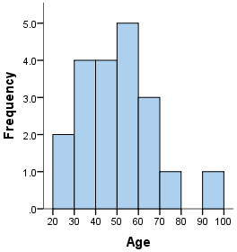

# Day 36

## 🔗 [84. Largest Rectangle in Histogram](https://leetcode.com/problems/largest-rectangle-in-histogram/description/)

A histogram is a graphical representation of data distribution. It is a type of bar chart that shows the frequency of data points within certain ranges or intervals, known as bins. Each bar in a histogram represents the number of data points that fall within a specific bin.

### Key Features of a Histogram:

1. **Bins (Intervals)**:
   - The x-axis of a histogram represents the bins or intervals into which the data is divided.
   - Each bin covers a specific range of values.
   - All bins should be of equal width.

2. **Frequency**:
   - The y-axis represents the frequency, or the number of data points that fall within each bin.
   - The height of each bar corresponds to the frequency of data points within that bin.

3. **Continuous Data**:
   - Histograms are typically used for continuous data where the data points can take any value within a range.


### Example : 



### Question 1 
I have  1D array where each element represent height . Calculate maximum area of array

## Code

### Brute Force Approach 1 :

```java
    private int largestRectangleArea(int arr[]) {
        int n = arr.length;
        int maxArea = 0;
        
        for (int i = 0; i < n; i++) {
            if (arr[i] != 0) {
                int height = arr[i];
                int width = 1; // width starts at 1 for the current position

                // Expand to the right
                int j = i + 1;
                while (j < n && arr[j] >= height) {
                    width++;
                    j++;
                }

                // Expand to the left
                j = i - 1;
                while (j >= 0 && arr[j] >= height) {
                    width++;
                    j--;
                }

                // Calculate the area for this height and update maxArea
                maxArea = Math.max(maxArea, width * height);
            }
        }
        
        return maxArea;
    }
```

### Brute Force Approach 2 : Using NSR(Next smaller to right) and NSL(Next smaller to left) GFG Question
- For each element find smaller element(j idx) to its right and left(k idx)
 - Formula width = j -k -1 ;
```java

```
### Optimum Approach : Using stack calculate NSR and NSL
```java
    class Solution {
        private void calculateNSL(int h[], int arr[]) {
            int n = h.length;
            Stack<Integer> s = new Stack<>();
            for (int i = 0; i < n; i++) {
                while (!s.isEmpty() && h[s.peek()] >= h[i]) {
                    s.pop();
                }
                arr[i] = s.isEmpty() ? -1 : s.peek();
                s.push(i);
            }
        }
    
        private void calculateNSR(int h[], int arr[]) {
            int n = h.length;
            Stack<Integer> s = new Stack<>();
            for (int i = n - 1; i >= 0; i--) {
                while (!s.isEmpty() && h[s.peek()] >= h[i]) {
                    s.pop();
                }
                arr[i] = s.isEmpty() ? n : s.peek();
                s.push(i);
            }
        }
    
        public int largestRectangleArea(int[] h) {
            int n = h.length;
            int NSR[] = new int[n];
            int NSL[] = new int[n];
            calculateNSR(h, NSR);
            calculateNSL(h, NSL);
            int maxArea = 0;
            for (int i = 0; i < n; i++) {
                int currArea = (NSR[i] - NSL[i] - 1) * h[i];
                maxArea = Math.max(maxArea, currArea);
            }
    
            return maxArea;
        }
    }
```